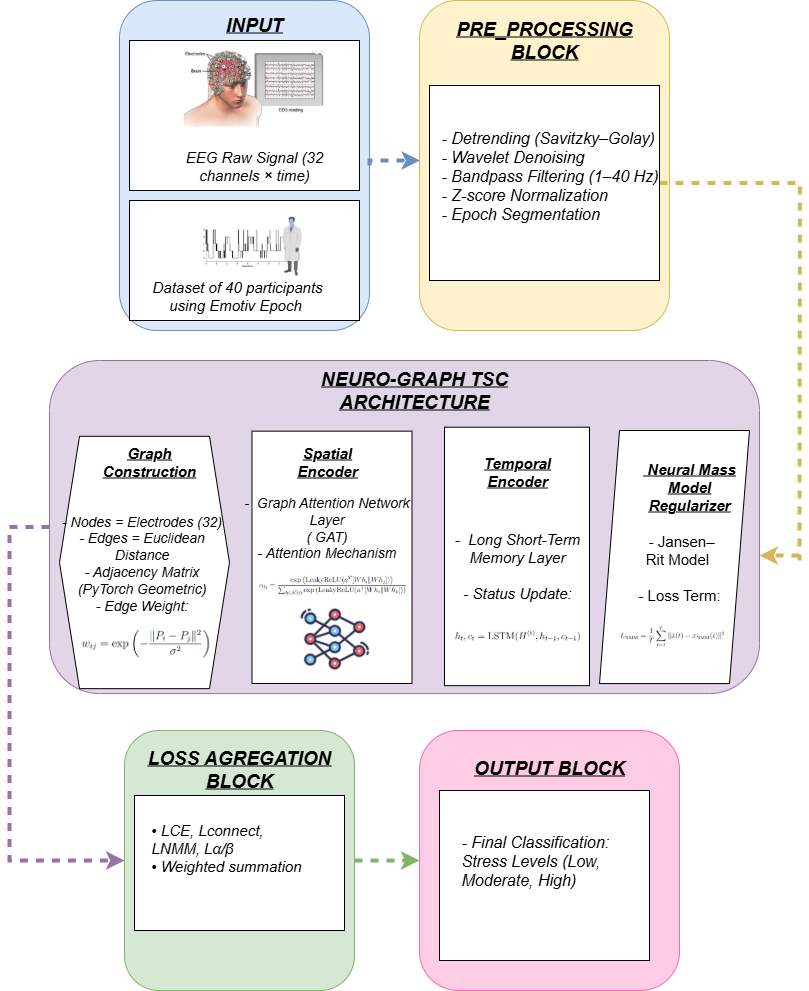

# 🧠 NeuroGraph-TSC: A Neuro-Inspired Graph-Based Temporal-Spatial Classifier for Cognitive State Prediction from EEG

Minimal **GNN + LSTM pipeline** for EEG with 32 electrodes:
- Spatial modeling with **Graph Attention Networks (GAT)** over an electrode graph  
- Temporal modeling with **LSTM** across time  
- Optional **neuroscience-inspired regularizers** based on neural mass models  

---

## 📐 Model Architecture

  
*Figure 1. Overview of the NeuroGraph-TSC architecture showing spatial graph encoding, temporal sequence modeling, and neural mass model-based regularization.*

---

## ⚡ Quickstart

```bash
# 1) Create environment and install dependencies
pip install -r requirements.txt

# 2) (PyG wheels) — choose your torch/CUDA combo:
# See https://data.pyg.org/whl/ for the right URL. Example (Torch 2.2 + CUDA 12.1):
pip install pyg-lib torch-scatter torch-sparse torch-cluster torch-spline-conv \
  -f https://data.pyg.org/whl/torch-2.2.0+cu121.html
pip install torch-geometric

# 3) Prepare your numpy arrays:
#    data.npy   shape (N, T, 32)
#    labels.npy shape (N,)   (strings or ints)

python scripts/run_train.py \
  --data-path /path/to/data.npy \
  --labels-path /path/to/labels.npy \
  --epochs 20 --time-steps 100
